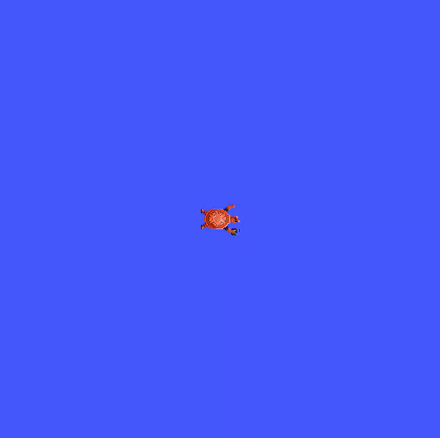
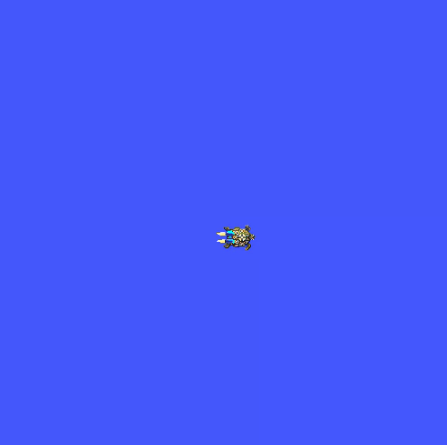

# ROS2 Exercise

Write a new the turtle do exactly one full circle.

- *Hint*: Think how does angular displacement can equate to a circle.

Complete the challenge and push you solution. If you are confident of your solution, open a PR and your solution will be included in the repo.

## Solution

A new package named `exercise_pkg` has been created. It includes a launch file that simultaneously launches the `turtlesim` simulation and the `teleop_key` node.

To use it, open a new terminal and run the following command:

```bash
ros2 launch exercise_pkg my_launch.launch.py
```

**Note**: Before running this command, ensure that you have built your workspace using `colcon build --merge-install` and sourced it by running `source install/setup.bash`

 

A Jupyter notebook has also been created with the code needed to make the turtle complete a circle. This notebook can spawn a new turtle and command the most recently spawned turtle to perform a circle.

 
